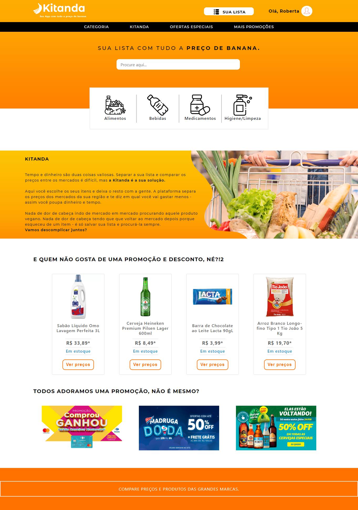
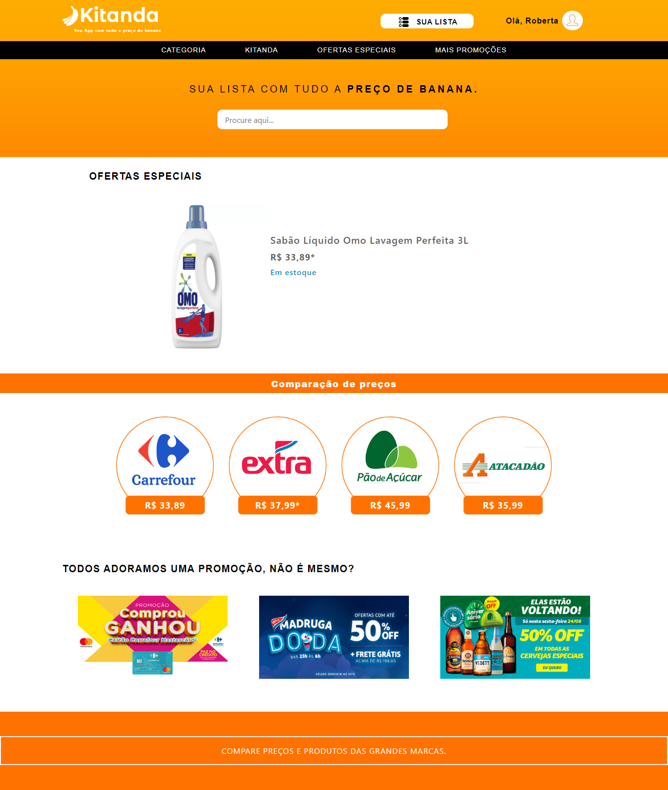
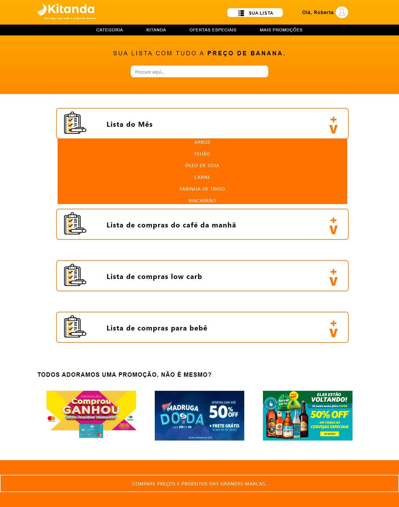

## SHOW ME THE STARTUP!

Assignment da GamaXp que consiste em criar uma startup fictícia. Acesse, <a href="https://kitanda.app/" target="_blank">KitandaApp</a>

## Kitanda :banana:

A Kitanda é a sua plataforma  que te ajudar a economizar tempo e dinheiro!
Você terá acesso a centenas de preços de produtos de supermercados da sua região em poucos segundos, bem prático e rápido!
E você ainda pode buscar o produto desejado pelo nome, criar suas listas de compras personalizadas e guardar várias listas para usar depois.

## 💻 Telas :

<h3>Home</h3>

Tela inicial, na qual é possível visualizar produtos mais destacados, possuindo seu preço e outras opções de navegação. ALém disso, é possível acessar sua lista de compras pessoal e verificar os produtos em oferta.

<h1 align="center">
    
</h1>  

<h3>Produto</h3>

Aqui, é possível verificr informações acerca do produto selecionado. Além disso, seu preço em comparação aos mercados próximos ao cliente.

<h1 align="center">
    
</h1>

<h3>Lista de Compras</h3>

Essa é lista personalisável do cliente. É possível criar novos item para cada lista para que assim, no futuro, o cliente possa comparar o preço total da lista entre os mercados.
                                                     

<h1 align="center">
    
</h1>

## 🚀 Tecnologias :

Foi desenvolvido com as seguntes tecnologias:

- HTML
- CSS
- Bootstrap
